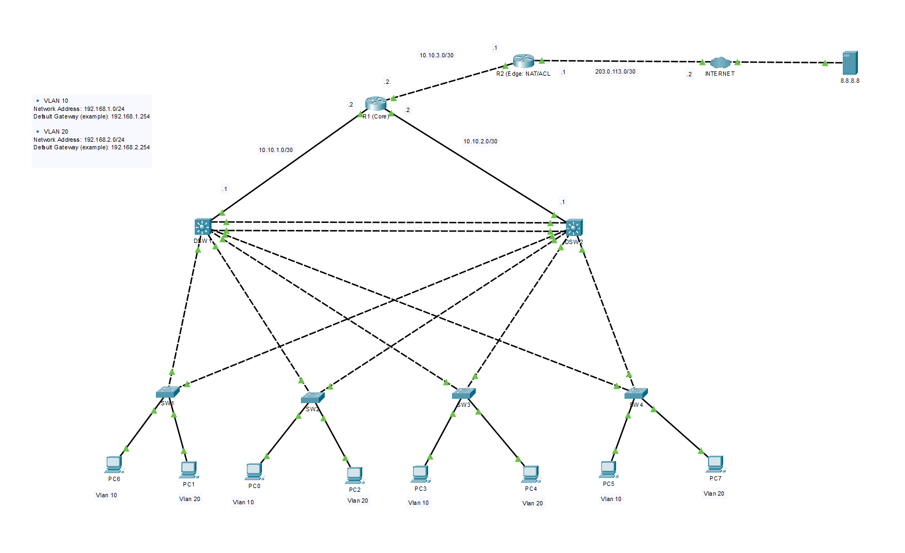

# Redundant Enterprise WAN with OSPF, HSRP & Edge NAT

## Overview

This project simulates a small enterprise network using a layered design (Access, Distribution, Core, and Edge) with redundancy and secure internet access.

The design implements:

- VLAN segmentation (VLAN 10 and VLAN 20) across the access layer
- Layer 3 distribution with SVIs and HSRP for default gateway redundancy
- OSPF Area 0 for dynamic routing from Distribution → Core → Edge
- Default route injection from the edge router to support “internet” reachability
- PAT (NAT overload) on the edge router
- Outbound ACL policy to control user access to common internet services

---

# Network Architecture

## Distribution Layer

- DSW1 – Layer 3 switch providing SVIs and HSRP (primary for 10 VLAN)
- DSW2 – Layer 3 switch providing SVIs and HSRP (primary for 20 VLAN)
- LACP EtherChannel between DSW1 and DSW2 for link aggregation

## Access Layer

- SW1–SW4 – Access switches connecting end devices to VLAN 10 and VLAN 20
- Trunk uplinks to distribution switches

## Core Layer

- R1 – Core router providing routed connectivity between Distribution and Edge

## Edge Layer

- R2 – Edge router connecting to ISP network
- Provides NAT and outbound access control
- Injects default route into OSPF

---

# VLAN & IP Addressing Plan

## VLANs

| VLAN | Purpose | Subnet         | Gateway (HSRP VIP) |
| ---- | ------- | -------------- | ------------------ |
| 10   | Users   | 192.168.1.0/24 | 192.168.1.254      |
| 20   | Users   | 192.168.2.0/24 | 192.168.2.254      |

## Transit Links (Example)

| Link        | Subnet | Notes                                      |
| ----------- | ------ | ------------------------------------------ |
| DSWs ↔ Core | /30    | Routed links between distribution and core |
| Core ↔ Edge | /30    | Routed link between core and edge          |
| Edge ↔ ISP  | /30    | Public/ISP simulation link                 |

Full details: documentation/ip-addressing-plan.md

---

# Key Technical Implementations

## HSRP Gateway Redundancy

- HSRP virtual gateway configured per VLAN
- Active/Standby behavior verified through failover testing
- Designed to keep user gateway consistent during distribution switch failures

## Layer 2 Reliability

- LACP EtherChannel used between distribution switches
- Spanning Tree tuned for predictable root bridge selection
- PortFast and BPDU Guard enabled on access ports (where supported)

## OSPF (Area 0)

- OSPF enabled across Distribution, Core, and Edge
- Loopback used for stable router ID (where applicable)
- Default route injected from Edge router into OSPF

## Edge NAT (PAT)

- NAT overload configured on Edge router for inside VLANs
- Internet traffic from VLAN 10 and VLAN 20 translated to the ISP-facing interface

## Outbound ACL Policy

- Outbound policy applied at the edge to control user traffic to common services
- Example: allow web (HTTP/HTTPS) and DNS; deny telnet
- Verified using ACL hit counters during testing

---

# Validation & Testing

The following tests were performed and verified:

- VLAN connectivity to HSRP gateway (VLAN 10 and VLAN 20)
- OSPF neighbor adjacency between Distribution, Core, and Edge
- Routing table validation (internal routes + default route propagation)
- NAT translation verification using live traffic tests
- ACL verification
- Failover testing (HSRP role change and continued connectivity)

Detailed steps available in: documentation/validation-tests.md

---

# Skills Demonstrated

- Enterprise network design (Access/Distribution/Core/Edge)
- VLAN trunking and segmentation
- Layer 3 switching (SVIs) and gateway redundancy (HSRP)
- Dynamic routing with OSPF
- Default route injection
- NAT/PAT configuration for internet access
- Basic security controls using ACLs
- Network validation and troubleshooting with CLI commands

---

# Author

Odjeissi Xavier Mendes  
CCNA | CompTIA Security+  
Aspiring Junior Network Engineer
